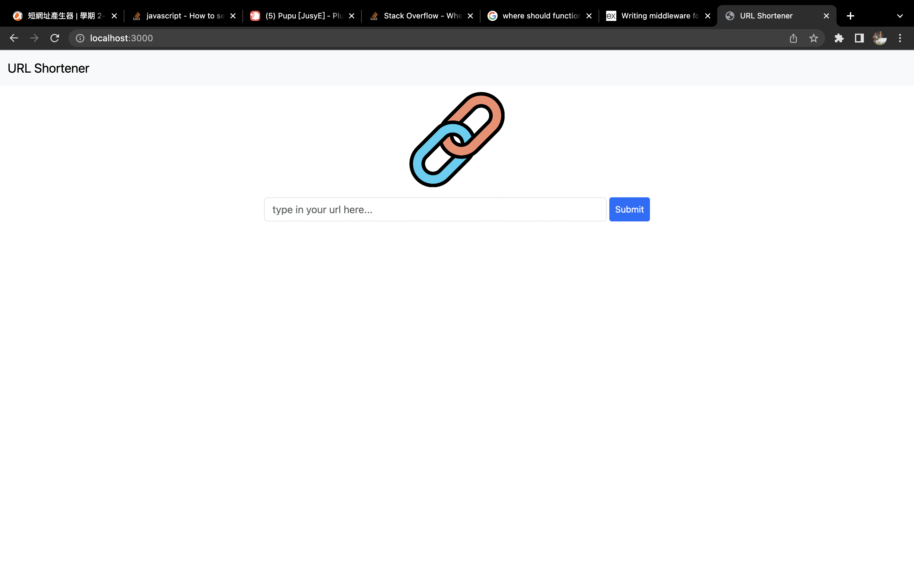

# 短網址產生器 ｜ URL Shortener

## 功能

- 主頁面中輸入網址
  
- 成功將顯示 Success！
  
- 未輸入網址或非網址格式將跳出錯誤提示
  

## 使用方式

1. 安裝 Node.js 以及 npm
2. clone 此專案

```
git clone "https://github.com/waterbear-tw/shortenUrl.git"
```

3. 進入專案資料夾安裝 package.json 中的套件

```
npm install
```

4. 在專案根目錄中新增.env 檔案

```
MONGODB_URI=mongodb+srv://<mongoDB資料庫對應之帳號>:<mongoDB資料庫密碼>@<資料庫位置(ex. cluster0.okrb8d7.mongodb.net)>/<資料庫名稱>?retryWrites=true&w=majority
```

5. 啟動專案，於終端機輸入

```
npm run start
```

6. 開啟瀏覽器輸入 localhost:3000 即可執行網站
7. 在終端機按下 ctrl + c 結束執行。

## 開發工具

- Node.js: 18.5.0
- npm: 9.5.0
- Express: 4.18.2
- Express-handlebars:7.0.7
- Bootstrap: 5.1.3
- Mongodb: 5.4.0
- Mongoose: 7.2.1
- body-parser: 1.20.2
- dotenv: 16.0.3
